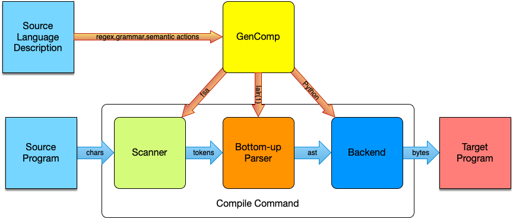

.. GenComp - A Compiler Generator documentation master file, created by
   sphinx-quickstart on Wed Feb  5 20:05:32 2020.
   You can adapt this file completely to your liking, but it should at least
   contain the root `toctree` directive.

Introduction
==========================================================

GenComp is a tool for building compilers. It is entirely written in Python and is very customizable.
The tool requires you to write a source language description. From this description of the
source language
it builds a scanner and a parser which will then parse a program in the given source language and take
whatever syntactic actions are specified in the language description. The semantic actions most
frequently would result in building an Abstract Syntax Tree (AST) for a given source language program.
But the actions
may result in directly interpreting the code, printing some information, or really anything that the
language designer wants to do.

  **Figure 1: Overview of GenComp Components**

GenComp serves two purposes. It is a full-fledged compiler generator, although it could use a few
enhancements that are described at the bottom of this web page. Just as importantly, GenComp serves
as a learning tool. The algorithms contained in GenComp include:

  * Regular Expression to NFA conversion
  * NFA to DFA conversion
  * DFA Minimization
  * LR0 Machine generation
  * Lookahead set detection

The first three algorithms are used in the *scangen.py* module. The last two algorithms are employed in
the *parsegen.py* module. Scangen and Parsegen were originally written by me in 1985 as Pascal programs
and were rewritten in 2016 as Python programs. At that time both Scangen and Parsegen were used to make
the *GenComp* compiler generator. While other tools like this exist, namely *lex* and *yacc* for just
about any language platform, including Python, the *GenComp* tool serves both as a tool for building
compilers and as a learning or teaching tool. Read on to discover how *GenComp* works.

A Simple One Memory Calculator
===============================

You can clone or download the github repository for the GenComp compiler generator by visiting
http://github.com/kentdlee/GenComp. Once you have cloned or downloaded the repository, you can
build the calculator example by executing

  *gencomp calc.txt*

Like the calculators you can get for free from banks, a one memory calculator is
very simple to implement using GenComp. The calculator has a single memory
location where a value can be stored with the *S* operator and recalled with the
*R* operator. Interacting with the calculator looks like this. A ctl-d (may have
to type this more than once) terminates the program.

.. code-block:: text
  :caption: **Figure 2: Running the Calculator**

  Kent's Mac> calculator
  Enter expressions with +,-,*,/,S (for store), and R (for recall) and terminated by a semicolon.
  S5*(R-1);
  20.0
  R*100;
  500.0
  Kent's Mac>

The entire specification of the calculator interpreter appears in the next section.

A Sample Language Specification
==================================

The source language specification consists of four sections as seen in the
example below. The *#CLASSES* starts the first section where classes of ASCII
characters are defined. The characters can be defined by ASCII numeric value or
individually with single quotes, with a range of single quoted values, or with
comma-separated values or ranges. The comma-separated syntax is not shown in
this example. The classes of characters may overlap. Specific sequences of
characters are not specified in the *#CLASSES* section.

The *#TOKENS* section defines the lexicon (i.e. the words) of the language. The first
two section serve as the input into the *Scanner Generator* which generates the *Scanner* portion
of a compiler or interpreter. The *Scanner* is used to form tokens from the individual characters
of the input file as shown in figure 1.

Skipping the description of the *#DEFINITIONS* for now, the *#PRODUCTIONS* section defines the
grammar and the semantic actions taken when a grammar rule is reduced by the parser. The Parser section
goes into more details about how the parser works. For now it's sufficient to know that when a rule is
matched in the source program, the semantic action to its right is evaluated. The semantic action is
evaluated in the context of the code in the *#DEFINITIONS* section.

.. code-block:: text
  :caption: **Figure 3: A Calculator Specification - calc.txt**
  :name: calc-txt

  #CLASSES

  digit   = '0'..'9';
  period = '.';
  EOF = 3;

  #TOKENS

  number = (digit.digit*)|(digit.digit*.period.digit.digit*);
  '(';
  ')';
  '+';
  '-';
  '*';
  '/';
  'S';
  'R';
  ';';
  endoffile = EOF;

  #DEFINITIONS

  from calcbackend import *

  #PRODUCTIONS

  Start ::= Prog endoffile                                             (Prog);

  Prog ::= Prog Stmt ';'                                               (None);

  Prog ::= null                                                        (None);

  Stmt ::= E                                                           (print(E));

  E ::= E '+' T                                                        (float(E)+float(T));
      | E '-' T                                                        (float(E)-float(T));
      | T                                                              (T);

  T ::= T '*' St                                                       (float(T)*float(St));
      | T '/' St                                                       (float(T)/float(St));
      | St                                                             (St);

  St ::= 'S' F                                                         (memory.store(float(F)));
      | F                                                              (F);

  F ::=  number                                                        (number);
      | '(' E ')'                                                      (E);
      | 'R'                                                            (memory.recall());

  #END

In this case, the *#DEFINITIONS* section imports the code found in figure 4 below. When rules are
matched, the semantic action to its right is evaluated. For instance, when a value is stored using
text like "S5", this rule is matched,

    St ::= 'S' F    (memory.store(float(F)));

and the value is stored in the memory location. NOTE: the value is also returned in figure 4
below. Every semantic action returns a value. The value returned is the result of evaluating the
semantic action.

In the rule above, the *F* (i.e. a Factor in the grammar of expressions) must be found first. The
rule

  F ::= number   (number);

is matched first to the '5' that appears in the input. Note that the '5' is in quotes for a reason.
The GenComp tool only understands strings during parsing, so the '5' is simply a number token,
not a number. When
the semantic action *(number)* is evaluated, it returns the string '5'.

In the *store* rule above, when *F* appears in the rule, it represents the '5' that was stored in this
second rule. So, when the semantic action *(memory.store(float(F)))* is executed, the *float* is
necessary to convert the string to a float.

In the calculator interpreter that is created from these semantic actions, the second two rules are
needed by the interpreter to be able to evaluate statements (i.e. semicolon-terminated expressions)
in the language. They don't have semantic actions associated with them so they return the Python value
*None* since every rule must have a semantic action.

.. code-block:: python
  :caption: **Figure 4: The Calculator Backend - calcbackend.py**

  class Memory:
    def __init__(self):
      self.mem = 0

    def store(self,val):
      self.mem = val
      return val

    def recall(self):
      return self.mem

  memory = Memory()

In figure 4 the *memory* variable is the memory of the calculator and is the one instance of the
*Memory* class. You can see the corresponding rules
in figure 3 where values are stored into and recalled from the *memory* location.

.. code-block:: bash
  :caption: **Figure 5: The calc Command**

  #!/bin/bash
  if [ $# -ne 1 ];
  then
    echo "usage: calc filename"
    echo "   Compiles or interprets filename as a program from the calc language."
    echo "   Read the gencomp documentation found in gencomp for a description of "
    echo "   of a gencomp language description file."
    exit
  fi
  python3 calc.py $1

The calc command shown in figure 5 is created by the GenComp tool. As you can see it invoke
python on the *calc.py* module whose contents are shown in figure 6. The code in figure 6 is
also automatically created by the GenComp tool.

.. code-block:: python
  :caption: **Figure 6: The Python calc Module - calc.py**

  import calcscanner
  import calcparser
  import sys

  def main():

      if (len(sys.argv)) != 2:
          print("usage: calc filename")
          print("   calc will interpret/compile the expression in the file named")
          print("   filename and print its result to standard output")
          return

      strm = open(sys.argv[1],"r")
      theScanner = calcscanner.calcScanner(strm)
      theParser = calcparser.calcParser()

      ast = theParser.parse(theScanner)
      print(ast)

  if __name__ == "__main__":
      main()

With the combination of the two programs in figures 5 and 6 you can invoke the
caculator as

  calc filename.txt

where *filename.txt* is a file containing semicolon terminated expressions. However, in the case
of the calculator interpreter it is more interesting to have a custom startup program. For that purpose
the program in figure 7 was written, by hand this time.

.. code-block:: bash
  :caption: **Figure 7: The calculator Custom Startup Command**

  #!/bin/bash
  if [ $# -ne 0 ];
  then
    echo "usage: calculator"
    echo "   This runs a command-line calculator for calculating expressions"
    echo "   as an example of how a parser and parser actions can be used to"
    echo "   evaluate expressions as they are typed."
    exit
  fi
  echo "Enter expressions with +,-,*,/,S (for store), and R (for recall) and terminated by a semicolon (i.e. ;)."
  python3 calculator.py

This startup script/program then invokes the custom Python startup program which is provided in figure
8.

.. code-block:: python
  :caption: **Figure 8: The calculator Custom Python Program - calculator.py**

  import calcscanner
  import calcparser
  import sys

  def main():

      strm = sys.stdin
      theScanner = calcscanner.calcScanner(strm)
      theParser = calcparser.calcParser()

      ast = theParser.parse(theScanner)

  if __name__ == "__main__":
      main()

As you can see, the code in figures 8 and 6 is nearly identical, differing in the prompt and where
the two programs get their input. In the custom program in figure 8 the input is read from
standard input.

Specifying Tokens
===================

TBD

Writing Grammars
=================

TBD

Creating a Backend
====================

TBD

Possible Enhancements
========================

There are several areas where improvements could be made to GenComp. One area is in the use of Bash
scripts in the generated compiler startup scripts. There is no need to use Bash when you have access
to Python. The first line of any script that runs python would be

  #/usr/bin/env python3

and after that you can write a python program to do anything a Bash program can do.

Another key improvement, but much harder in comparison to the first, would be to extend the
regular expression language supported by GenComp. Right now the regular expression language
is pretty limited in its power, but it could be enhanced to more fully support the regular expressions
of *lex*.

.. toctree::
   :maxdepth: 2
   :caption: Contents:
